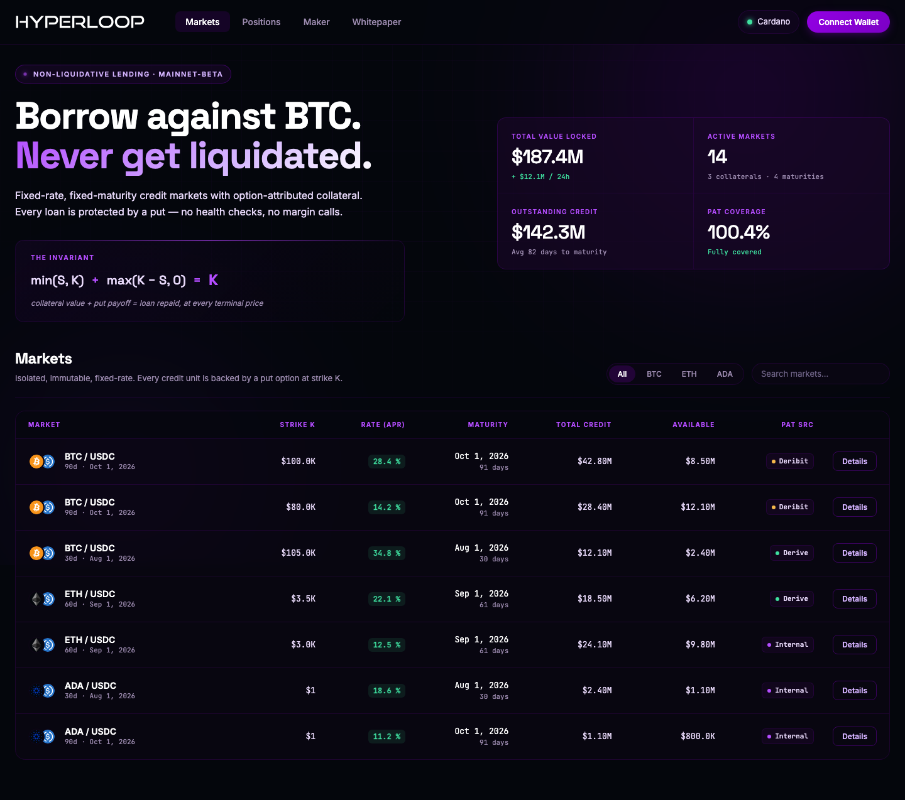
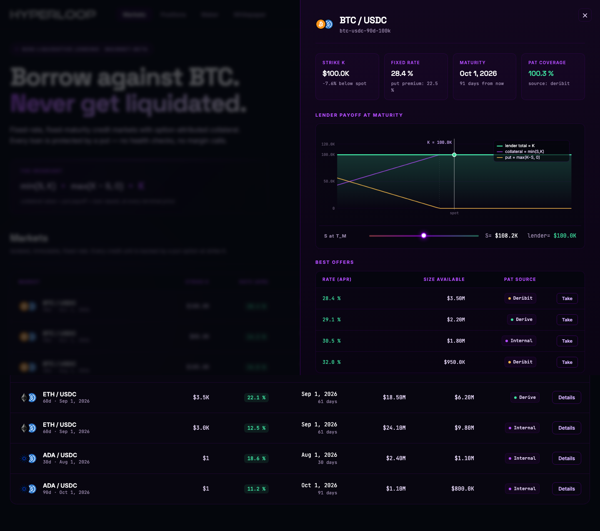
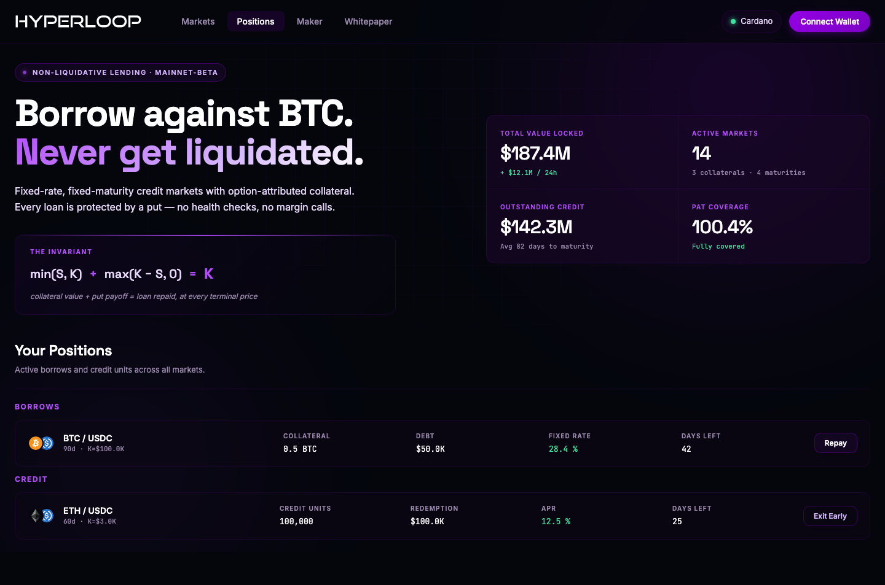
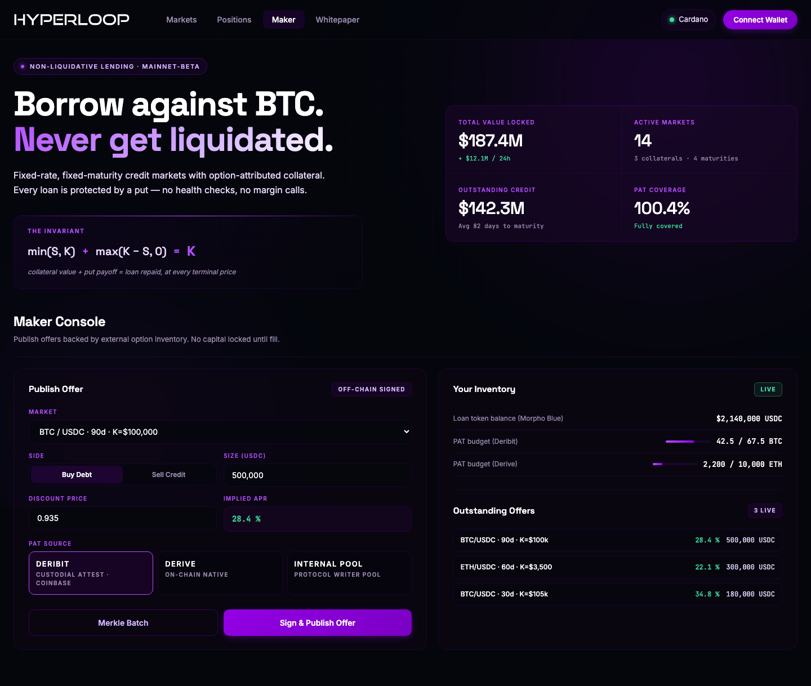

# Hyperloop Awakening — MVP

Frontend prototype of the **Hyperloop Awakening** non-liquidative lending protocol. Demonstrates the borrower, lender, and maker flows against a mocked market state — no wallet connection, no on-chain calls, no backend.

> [!NOTE]
> This is a **UI-only demonstrator**. Market data, PAT sources, and offer books are seeded from static fixtures inside [`app.js`](./app.js). All rates, sizes, and payoffs are illustrative. The production protocol specification lives in the [whitepaper repository](https://github.com/Hyperloop-Finance/awakening-whitepaper).

---

## Screenshots

### Markets

Fixed-rate, fixed-maturity credit markets, filtered by collateral and searchable by name. Each row shows strike, maturity, oracle rate, available size, and the PAT source class backing the option leg.



### Market Detail

Per-market panel: strike, fixed rate, maturity, PAT coverage, interactive lender payoff-at-maturity chart parameterized on $S_{T_M}$, and the best-offer stack across PAT sources.



### Positions

Borrower and lender positions, grouped. Borrower rows show collateral, obligation, fixed rate, and days to maturity — with a **Repay** action. Lender rows show credit units, notional, coupon, and days to maturity — with an **Exit** action for early exit via the credit-unit secondary.



### Maker Console

Maker-side UI for publishing executable, capital-efficient offers across many strikes and maturities. Left: **Publish Offer** form (market, strike, size, discount price, PAT source). Right: live **Inventory** panel and **Outstanding Offers** feed.



---

## The Protocol in One Identity

The entire MVP is a UI on top of one algebraic invariant, evaluated at loan maturity $T_M$:

$$\min(S_{T_M}, K) + \max(K - S_{T_M}, 0) = K$$

Every credit unit pays exactly $K$ loan tokens at maturity, regardless of the terminal collateral price. **No oracle read during the term. No health check. No margin call. No liquidator. Path-independent by construction.**

Read the full protocol specification: [awakening-whitepaper](https://github.com/Hyperloop-Finance/awakening-whitepaper).

---

## Run It Locally

**Zero build step. Zero dependencies. Pure HTML/CSS/JS.**

### Option 1 — Python (recommended, no install)

```bash
git clone https://github.com/Hyperloop-Finance/awakening-mvp.git
cd awakening-mvp
python3 -m http.server 8000
```

Open [http://localhost:8000](http://localhost:8000).

### Option 2 — Node.js `serve`

```bash
git clone https://github.com/Hyperloop-Finance/awakening-mvp.git
cd awakening-mvp
npx serve .
```

### Option 3 — Any static file server

Point any HTTP server at the repository root. The MVP is entirely client-side — every file loaded is under version control and there is no server-side logic.

### Option 4 — Direct file open (limited)

Open `index.html` directly in a browser. Icons and Google Fonts will load; local relative fetches work under `file://` for this MVP because there are none. However, **serving via HTTP is recommended** so future extensions (e.g., real oracle feeds) will work without CORS drama.

---

## Repository Layout

```
awakening-mvp/
├── index.html              # single-page app entry
├── styles.css              # all styles — dark theme, "black hole" ambient
├── app.js                  # state, rendering, tab logic, payoff SVG, fixtures
├── hyperloop-mark.svg      # square mark
├── hyperloop-wordmark.svg  # horizontal wordmark used in the header
├── assets/
│   └── tokens/             # BTC / ETH / ADA / USDC token icons
└── screenshots/            # UI reference for this README
```

There is intentionally no `package.json`, no bundler, no framework. The MVP is optimized for readability — the entire logic surface is one HTML file, one CSS file, and one JS file totaling ~75KB uncompressed.

---

## Tech Choices and Non-Choices

- **No framework.** Vanilla JS with a small `$` / `$$` DOM helper. State lives in a single `state` object at the top of `app.js`; a `switchTab(name)` function drives re-renders. This is deliberate: the MVP is a fixture-driven prototype, not a production dApp, and adding React / Vue / Svelte would obscure the protocol semantics we want to demonstrate.
- **No wallet integration.** The **Connect Wallet** button and the transaction modal are cosmetic. Wiring in ethers / viem is straightforward when the on-chain contracts are ready; see the roadmap below.
- **No live oracle.** The market strike-comparison line and the PAT-coverage badge use fixture data. In production, `oracle` is a market-creation parameter (see whitepaper §2.1) and settlement reads it exactly once at $T_M$.
- **No routing.** The URL never changes. Tab state is transient and lives in memory.
- **SVG-first visualization.** The lender payoff chart, the ambient background glow, and the token icons are all inline or file-loaded SVG — no chart library, no canvas.

---

## Screens — What Each One Demonstrates

### Markets tab

- Filter by collateral (BTC / ETH / ADA) and search by market name.
- Each row summarizes the market tuple $M = \langle \text{collateral}, \text{loan}, \text{oracle}, T_M, K, \text{settlement}, \text{gates} \rangle$ — strike ($K$), maturity ($T_M$), fixed rate (the maker's best current quote), available size, and the PAT source class (`Deribit-attested`, `Derive`, `IBIT-listed`, `Internal pool`).
- The hero **"Never get liquidated"** copy, together with the identity block $\min(S,K) + \max(K-S, 0) = K$, is the elevator pitch for the borrower cohort — long-duration holders (treasuries, family offices) who refuse path-dependent forced sale.

### Market Detail modal

- **Payoff at maturity** — an interactive SVG chart of the lender's per-unit recovery $R(S_{T_M}) = \min(S_{T_M}, K) + \max(K - S_{T_M}, 0)$ as a function of $S_{T_M}$. Drag the slider to move $S_{T_M}$ and see the constant lender payoff line at $K$.
- **Best offers** — a stack of executable maker offers on this market: date, size available, PAT source, and a Details button that opens the transaction modal.
- **PAT coverage badge** — the fraction of aggregate credit issuance in the market currently covered by attributed PATs.

### Positions tab

- **Your Borrows** — active loans where the connected address is the borrower. Shows collateral posted, current obligation, fixed rate, days to maturity, and a **Repay** action.
- **Your Credit** — active credit unit holdings where the connected address is the lender. Shows credit units held, notional at $T_M$, coupon, days to maturity, and an **Exit** action (sells credit units into the market's early-exit path, whitepaper §2.4).

### Maker Console

- **Publish Offer** — form to publish an executable offer against a market: strike, size, discount price, and PAT source (Deribit-attested / Derive / Internal pool). The Sign & Publish button represents the maker signature step; the ratifier contract verifies the signature at fill time (whitepaper §3.1).
- **Inventory** — live view of the maker's loan token balance and standing PAT positions across venues.
- **Outstanding Offers** — the maker's currently published offers, with market, size, and status.

---

## Roadmap for This MVP

- [ ] Wire wallet connection (viem + wagmi) so the header "Connect Wallet" reflects the actual connected account.
- [ ] Replace market fixtures with an on-chain read via a subgraph or direct RPC on a testnet deployment of the Solidity reference contracts.
- [ ] Add live BTC / ETH / ADA spot feeds so the market detail chart's $S_{T_M}$ slider defaults to spot and updates the "Lender total" line dynamically.
- [ ] PAT source status pane on the Maker Console — real-time reachability for Deribit attestor feeds and Derive on-chain option markets.
- [ ] Transaction modal → real transaction submission through the connected wallet.
- [ ] Multi-language / dark mode toggle (currently dark only, English only).

---

## Contributing

- **Fork** for design proposals or UX experiments. The MVP is a scratchpad; opinionated visual changes are welcome as long as the four core screens (Markets, Market Detail, Positions, Maker) remain understandable at a glance.
- **File issues** for UX friction, incorrect labels, or copy that misrepresents the protocol semantics.
- **Do not open PRs** that add build steps or frameworks without prior discussion — the no-build-step property is a design invariant of this repo.

---

## License

MIT. See [`LICENSE`](./LICENSE).

The Hyperloop Awakening protocol specification (the [whitepaper](https://github.com/Hyperloop-Finance/awakening-whitepaper)) and the eventual Solidity / Aiken reference implementations may carry different licenses.

---

## Links

- **Whitepaper repo**: [github.com/Hyperloop-Finance/awakening-whitepaper](https://github.com/Hyperloop-Finance/awakening-whitepaper)
- **Organization**: [github.com/Hyperloop-Finance](https://github.com/Hyperloop-Finance)
